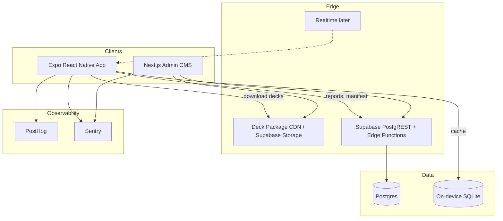

# Did They Tweet That? — Full Product Plan

**Date:** 2026-07-18  
**Status:** Research & planning complete — no application code  
**Not legal advice.** See `legal-and-platform-risks.md`.

Detailed topic docs live alongside this file; this document is the ordered master brief.

---

## 1. Executive summary

**Did They Tweet That?** (working title) is a fast local party game: players see a statement attributed to a public figure and decide whether that person really posted or said it. The MVP centers on Heads Up–style play (phone facing the group) plus pass-and-play scoring, with a single mode—Real or Fake.

**For:** 18–28 friend groups who want laughter with almost no rules.

**Why it could work:** Instant rules; cultural literacy about “internet voice”; proven party formats (Heads Up, Psych!, Jackbox); existing web demand for real/fake tweet quizzes.

**Why it might fail:** Content rights, false-attribution liability, weak decks, flaky motion, and a name tied to X/Twitter trademarks.

**Differentiator:** Physical social ritual + authenticity judgment, with a content architecture not permanently married to one platform.

**Largest risk:** Safe, funny, legally defensible content supply.

**Recommendation:** **Conditional go** — Phase 0 validation + counsel before scale. Prefer a platform-neutral master brand.

---

## 2. Current-market research

**[Fact]** Real/fake tweet quizzes exist (e.g. GeoMapGame Trump Tweet Quiz; Sporcle “Did Trump Really Tweet It?”).  
**[Fact]** Party category is mature: Heads Up!, Charades!, Psych!, Jackbox.  
**[Assumption]** No dominant multi-celebrity native party app owns this exact authenticity loop.  
**[Recommendation]** Mechanic is familiar; packaging + multi-deck party UX is the bet.

Sources and analysis: `market-research.md`.

---

## 3. Competitive analysis

| Competitor | Lesson |
|---|---|
| Heads Up! / Charades! | Motion party ritual works; monetize decks; watch quality/bugs |
| Psych! | Bluff/authenticity party + paid decks already shipped |
| Jackbox | Party time is precious; originality + ease win |
| Web tweet quizzes | Prove curiosity; fail at retention/social ritual |
| Fake-tweet makers | Adjacent; we must not be a forgery tool |

**Wedge:** One-phone authenticity party game with clear fabrication labeling and offline decks.

---

## 4. Legal and platform-policy analysis

X API in 2026 is reported pay-per-use (no meaningful free tier for new apps), with strict display/deletion/redistribution rules—poor fit for offline party mirrors. Right of publicity, copyright, defamation, Apple 1.2 UGC, and Google Play deceptive-media rules all apply. **Counsel required** before store launch.

**Safer MVP:** No live X client dependency; no profile photos; labeled fabrications; human decoys; report + tombstones.

Full write-up: `legal-and-platform-risks.md`.

---

## 5. Product positioning

**Party game first.** Trivia second. Not a news app, not a UGC platform at launch.  
Launch under a **broader brand**; “Did They Tweet That?” as a deck/mode pending trademark review.

---

## 6. Primary user and jobs to be done

**Primary user:** College/young-adult friend groups at parties, dorms, bars.

**JTBD:** Start laughing fast; zero explanation; test celebrity-voice recognition; create shareable surprise; fill 5–15 minutes with one phone.

---

## 7. Recommended MVP

- Formats **A (forehead)** + **B (pass-and-play)**  
- Mode: **Real or Fake** only  
- 3–5 editorial decks, offline after download  
- Timer, score, review with Verified/Fabricated badges  
- Tap/no-motion accessibility  
- Reports, analytics, crash reporting, remote kill-switch  
- No accounts, no multiplayer, no IAP  

---

## 8. Features excluded from MVP

Who Posted It, Bluff, AI-or-Real, viral comparisons, chronology, public custom decks, live X hydration, profile photos, video recording, ads-in-round, streaks/push, room-code multiplayer, subscriptions.

---

## 9. Gameplay specification

See `gameplay-spec.md`. Default timer 45–60s; tilt down = “they did,” tilt up = “they did not”; scoring +100 correct, optional −25 wrong; review labels mandatory.

---

## 10. UX and accessibility plan

See `ux-spec.md`. High-contrast dark party UI; dynamic statement sizing; landscape forehead; wake lock; VoiceOver → tap mode; colorblind-safe feedback; reduced motion support.

---

## 11. Content strategy

Editorial-first hybrid; no scraping; no client X API. Two-person review; harmless fabrications; politics deferred. Ops: `content-operations.md`. Schema: `data-model.md`.

---

## 12. Technical architecture

Expo + TS mobile; Zustand; TanStack Query; Reanimated/GH; expo-sensors/haptics; SQLite; Supabase; Next admin; PostHog; Sentry; RevenueCat later. Details: `architecture.md`.

---

## 13. Mermaid architecture diagram



---

## 14. Database schema

Canonical SQL and client package shape: `data-model.md`.

---

## 15. Motion-control design

DeviceMotion gravity tilt; deadzone/commit/cooldown; calibration; tap fallback; fixture-tested state machine. Pseudocode in `architecture.md` §9.

---

## 16. Offline strategy

Cache deck packages + sessions; semver + tombstones; reports outbox; no multiplayer/account features offline.

---

## 17. Security and moderation model

RLS, editor roles, rate-limited reports, audit logs, no public UGC in MVP. See `security-and-moderation.md`.

---

## 18. Analytics plan

North-star: **rematch rate**. Event taxonomy in `analytics-plan.md`.

---

## 19. Testing strategy

Jest/RNTL, motion fixtures, Maestro, Playwright admin, Supabase RLS tests. See `testing-strategy.md`.

---

## 20. Performance targets

Cold start &lt;2.5s; first playable &lt;5s cached; 60fps; crash-free ≥99.5%; deck &lt;1.5MB/150 cards. See `roadmap.md`.

---

## 21. Delivery roadmap

Phase 0 validation → Phase 1 MVP → Phase 2 retention/IAP → Phase 3 multiplayer. Exit criteria in `roadmap.md`.

---

## 22. Prioritized backlog

Epics and stories: `backlog.md`. First implementation tasks listed in README handoff.

---

## 23. Repository structure

**Monorepo justified** (shared types, engine, validation).

```text
apps/mobile          # Expo RN
apps/admin           # Next.js CMS
packages/ui
packages/types
packages/config
packages/game-engine
packages/content-validation
supabase/            # migrations, policies, functions
docs/
```

**Naming:** `kebab-case` files; `PascalCase` components; SQL `snake_case`.  
**State boundaries:** Zustand = ephemeral session; TQ = server; SQLite = durable local.  
**API boundary:** PostgREST + Edge Functions only; no service keys on device.  
**Shared types:** Zod in `content-validation`, types inferred.  
**Env:** `EXPO_PUBLIC_*` for public; secrets in EAS/Supabase.  
**Branching (current):** `main` is not remotely protected on the current private-GitHub plan. `feature/*` branches and pull requests are required operating practice, but GitHub cannot technically prevent a direct update.
**CI/CD (current):** DesignOps policy runs in GitHub Actions for push/PR visibility, but is advisory rather than a server-enforced merge gate. Run local hooks and inspect the workflow before merge; typecheck/lint/unit/schema and EAS preview remain planned delivery checks. Production promotion remains manual.
**Future remote enforcement:** If an eligible GitHub plan becomes available, protect `main` and require pull requests, the DesignOps status check, approval/CODEOWNER review, stale-approval dismissal, and blocked force pushes/deletions before calling the branch protected.
**Channels:** development / preview / staging / production.

---

## 24. Architecture decision records

See `decision-log.md` (ADR-001 … ADR-012).

---

## 25. Risk register

See `risk-register.md`. Top: X dependency, licensing/attribution, content quality, trademark/name, motion reliability.

---

## 26. Open questions

See `open-questions.md`. Critical blockers: brand clearance, fabrication counsel, editorial owner, Phase 0 success bar.

---

## 27. Final go/no-go recommendation

| Decision | Verdict |
|---|---|
| Fund Phase 0 prototype | **GO** |
| Depend on X API for launch | **NO-GO** |
| Ship store build under unchecked “Tweet” name | **NO-GO until counsel** |
| Build realtime multiplayer now | **NO-GO** |
| Proceed to Phase 1 after Phase 0 metrics + legal prelim | **GO if exit criteria met** |

**Overall:** Conditional go — validate fun and legal patterns before scaling engineering.

---

## 28. Exact next steps for beginning implementation

1. Retain counsel for trademark + fabrication/publicity memo.  
2. Pick provisional master brand for engineering package IDs.  
3. Assign editorial owner; write 80 Phase 0 cards under safety rules.  
4. Run 3 paper playtests (no app).  
5. Initialize monorepo (Expo + packages) **only after** steps 1–4 kickoff started.  
6. Implement game-engine + static deck + tap-mode round (motion second).  
7. Instrument analytics events.  
8. Playtest on devices; tune timer/copy.  
9. Stand up Supabase + report endpoint before external TestFlight.  
10. Re-evaluate go/no-go for Phase 1 using rematch + legal checklist.
