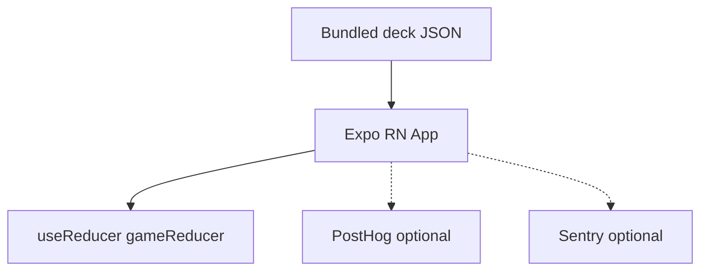
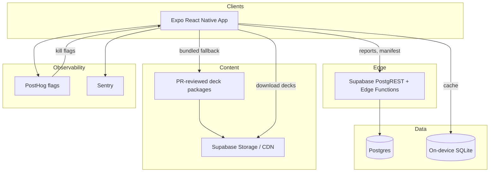

# Technical Architecture

**Date:** 2026-07-18 (revised 2026-08-12 to match shipped MVP)  
**Client:** React Native + TypeScript  
**Objective:** Validate local party fun fast — no platform cosplay in Phase 0

---

---

## Shipped MVP stack (authoritative for `apps/mobile/`)

What is actually running today — prefer this over the aspirational Phase 0 table below when they disagree:

| Layer | Shipped |
|---|---|
| Mobile | Expo + TypeScript; screen flow is a stage switch in `App.tsx` (no Expo Router) |
| Session | `useReducer(gameReducer)` with pure rules in `src/domain/` |
| Content rules | `src/domain/contentRules.js` — run length, content states, report reasons, https/source helpers |
| Storage | AsyncStorage adapters under `src/storage/` (no SQLite yet) |
| Deck validation | Pure JS `validateDeck` + `isPlayableCard` (no Zod in the app) |
| Content pipeline | `tools/content-pipeline/` emits `deck.generated.js`; imports shared https helpers from `contentRules` |
| Sensors / feedback | `expo-sensors`, `expo-haptics`, local announce helpers |

Defer Expo Router, Zustand, Zod, TanStack Query, and SQLite until a concrete pain or Phase 1 remote requirement appears.

---

## Locked decisions (post-review)

| Topic | Decision |
|---|---|
| Engineering package / bundle id | **SaidThat** (`com.saidthat.app` provisional); store brand pending counsel |
| Phase 0 content | **Bundled deck JSON only** — no Supabase required to play |
| Forehead motion | **Phase 0 must-have** (tap remains accessibility fallback) |
| Answer secrecy | Authenticity on-device in plaintext is **OK** (party game, not competitive anti-cheat) |
| Kill switches | **Both:** manifest/bundled tombstones **and** PostHog flags (PostHog after debug-log Phase 0) |
| Local DB | **Raw `expo-sqlite`** — no Drizzle until query pain is real |
| Editorial tooling | **JSON + PR review** until rematch is proven — no Next.js admin yet |
| Reduce Motion | **Animation only** — does **not** disable tilt |
| First analytics | **Debug event log only** — no PostHog in first scaffold |

---

## 1. Phase split (do not conflate)

### Phase 0 — validation prototype (build this first)

| Include | Exclude |
|---|---|
| Expo app + stage routing in App (Router optional later) | Supabase / CDN deck pipeline |
| Bundled deck from content pipeline (pure JS validation) | Next.js admin CMS |
| Forehead motion + tap fallback | TanStack Query (nothing remote yet) |
| AsyncStorage for reports & playtest export | Report outbox → server |
| `useReducer` game session | RevenueCat, push, realtime |
| Optional PostHog + Sentry (or debug event log) | Package download/checksum CDN |
| PostHog kill flags for deck/card ids (if analytics on) | “Optional session sync” |

**Phase 0 play path:** install → Home → start round → tilt/tap → results → review → rematch. Works fully offline with zero backend.

### Phase 1 — MVP (only after Phase 0 exit criteria)

Add: multiple bundled and/or downloadable decks, raw SQLite deck cache, manifest + tombstones, report API, TanStack Query, remote kill list in manifest **plus** PostHog flags, EAS preview/staging. Still **no** Next admin — editors ship content via PR-reviewed JSON/packages.

### Phase 2+

Accounts, IAP, admin CMS if content volume demands it, multiplayer, etc.

---

## 2. Recommended stack

| Layer | Phase 0 | Phase 1+ | Why |
|---|---|---|---|
| Mobile | **Expo development build** | Same | Motion permissions, orientation lock, store-like behavior. Expo Go OK for early UI; **forehead QA requires a dev build** |
| Navigation | Stage switch in `App.tsx` | Expo Router if deep links hurt | File-based router is optional until navigation complexity appears |
| Session state | **`useReducer` + pure `gameReducer`** | Zustand if cross-tree session sharing hurts | Round/timer/answers stay testable without a store library |
| Server state | — | **TanStack Query** | Manifests, reports only when remote exists |
| Validation | **Pure JS `contentRules` / `validateDeck`** | Zod if schema churn hurts | Matches existing Node test idiom |
| Player names | Controlled inputs | Same | **No React Hook Form** until forms hurt |
| Motion UI | Core RN `Animated` + `useNativeDriver` | Same | Discrete answer events only; avoid Reanimated on Hermes V1 |
| Sensors | **expo-sensors** `Accelerometer` (~10 Hz) | Same | Room Beacon tilt; forehead QA on physical devices / dev builds |
| Haptics | expo-haptics | Same | Answer confirmation |
| Audio | `expo-audio` optional | Same | Playback cues only; `expo-av` is deprecated |
| Local DB | **AsyncStorage** for queue/stats | **Raw expo-sqlite** | Decks/sessions/outbox — no Drizzle |
| Content authoring | JSON in repo + PR | Packaged JSON + PR | Admin CMS deferred |
| Backend | None required | **Supabase** when reports/manifests needed | Not a Phase 0 dependency |
| Analytics / flags | PostHog optional | PostHog | Flags **and** manifest tombstones |
| Errors | Sentry optional | Sentry | Before external TestFlight |
| Payments / push / realtime | — | Later | Out of scope |

### Expo Go vs development build

| Use | When |
|---|---|
| Expo Go | Layout, tap-mode flows, copy |
| **Development build (`expo-dev-client`)** | Forehead motion QA, `NSMotionUsageDescription`, orientation lock, release-like bundle ID |

Do **not** plan on classic “eject.” Use CNG/prebuild if native config is needed.

### Why not Firebase / custom API / Drizzle (unchanged rationale, tighter timing)

- Supabase only when Phase 1 remote content/reports exist.  
- Custom API still premature.  
- Drizzle deferred: six local tables do not justify ORM + migration kit yet.

---

## 3. Component diagram

### Phase 0



### Phase 1



Editors do **not** get a CMS app in Phase 0–1; they open PRs that update deck JSON / packages. CI runs the content-pipeline validators (pure JS).

---

## 4. Data flows

### App startup (Phase 0)

1. Init Sentry/PostHog if enabled  
2. Load settings (SecureStore or SQLite)  
3. Load bundled deck; apply **local tombstone list** + **PostHog disable flags** if available  
4. Route Home — **never block Home on network**

### App startup (Phase 1 additions)

5. If online: fetch manifest (timeout ~2s; abandon on captive-portal hang)  
6. Merge server tombstones into SQLite; drop killed cards from cache  
7. Offer deck updates; keep last-known-good package if download fails  

### Round creation

- Pure client: sample cards from **in-memory deck after kill filters**  
- Create local session id; persist answers if SQLite present  
- Re-apply tombstones/flags **before each round and before drawing each card** (not only on next cold start)

### Answers / score

- `apps/mobile/src/domain/game.js` owns scoring and stage transitions; `runBuilder.js` owns card sampling for a run  
- Authenticity fields ship in the bundle — treat as game data, not a secret  

### Analytics

- Prefer `card_id`; avoid logging full statement text  
- Never emit Accelerometer samples  

### Reports (Phase 1)

- Queue locally; flush when online  
- Server must accept reports for ids that exist in published packages (seed card rows when publishing a package, or accept report-by-id without hard FK until CMS exists)

---

## 5. Content & kill-switch model

### Bundled deck (Phase 0)

- Path e.g. `packages/content/decks/phase0.json` (exact path chosen at scaffold)  
- Zod schema in `packages/content-validation`  
- CI fails on invalid decks  

### On-device authenticity (explicit)

Packages include `authenticity`. Anyone can read them. Acceptable for local party play. Do not claim cryptographic verification. Do not trust client session summaries as anti-cheat if sync is added later.

### Kill switches (both)

| Layer | Mechanism | Role |
|---|---|---|
| **Source of truth for shipped content** | Tombstone ids in bundle / manifest | Works offline after update; legal takedown via app update or manifest pull |
| **Fast remote override** | PostHog feature flags / disable lists | Hide deck or card ids without waiting for store review when online |

**Merge rule:** card playable iff not tombstoned **and** not flag-disabled. If PostHog is down, last cached flags apply; tombstones from last successful manifest/bundle still apply. Prefer failing closed on **explicit** disable flags cached locally.

---

## 6. Offline strategy

| Data | Phase 0 | Phase 1 |
|---|---|---|
| Deck | Bundled in binary | Bundled + downloaded packages in SQLite/files |
| Versioning | App version + deck `contentVersion` | `deck_id + semver` + checksum |
| Invalidation | App update; PostHog flags when online | Manifest tombstones + higher semver + flags |
| Scores | Local | Local (cloud sync optional later) |
| Reports | N/A or local-only note | Outbox → API |

**Unavailable offline (Phase 1):** browsing new remote decks, fresh flag fetch, report delivery, source link previews.

**Corrupt download:** never mark ready until checksum + Zod pass; keep previous version.

**In-place same-semver replace:** forbid — bump semver whenever bytes change.

---

## 7. Local persistence (raw expo-sqlite)

Phase 1 tables (minimal):

- `decks_local` — id, version, checksum, path, ready  
- `cards_local` — denormalized playable fields from package  
- `tombstones` — card_id, reason, removed_at  
- `settings` — key/value  
- `local_sessions` / `local_answers`  
- `outbox_reports`  
- `flag_cache` — last known PostHog disables  

Use raw SQL + a tiny repository module. Add Drizzle only if this becomes painful.

Phase 0 may skip SQLite entirely and use SecureStore/AsyncStorage for settings + in-memory sessions.

---

## 8. Security model (summary)

- No service-role keys on device  
- Phase 0: almost no attack surface (local game)  
- Phase 1: RLS on reports/manifests; rate-limit reports (device id is **best-effort**, spoofable — say so)  
- Checksums = integrity against corruption, **not** proof against a compromised Storage object; optional Ed25519 package signatures if threat model requires it later  
- Trust boundary for playable text is the **package pipeline + PR review**, not Postgres RLS  

Full policy detail: `security-and-moderation.md` (update when Phase 1 backend lands).

---

## 9. Multiplayer

Unchanged: local pass-and-play only until Phase 3. No realtime in architecture critical path.

---

## 10. Performance targets

| Metric | Target | Notes |
|---|---|---|
| Cold start → Home | &lt; 2.5s mid-tier | Must not await network |
| First playable round (bundled) | &lt; 5s from Home | |
| Active round UI | 60fps | Sensor pipeline must not re-render at 30Hz |
| Gesture recognition | Intentional tilt accepted in ~300–500ms | Includes debounce; drop “&lt;50ms detect” vanity SLA |
| Duplicate answers | &lt; 1% in fixture replay | Includes still-tilted between cards |
| Crash-free | ≥ 99.5% soft launch | |
| Deck package | Text decks ≪ 1.5MB / 150 cards | Budget is not a real constraint |

---

## 11. Environments

| Env | App | Backend |
|---|---|---|
| Development | Expo Go (UI) + **dev client** (motion) | None in Phase 0; local Supabase in Phase 1 |
| Preview | EAS preview | Staging Supabase (Phase 1+) |
| Staging | Internal TestFlight/Play | Staging |
| Production | Store | Prod |

Content promotion Phase 0–1: **merge PR → cut build** (or Phase 1: publish package to Storage from CI). No CMS promotion UI yet.

---

## 12. Motion-control design

### Requirements

- Phase 0 **must** support forehead tilt  
- Tap-only / no-motion settings and VoiceOver → tap (not Reduce Motion)  
- OS Reduce Motion: disable confetti/shake animations only  
- Landscape preferred for forehead; Accelerometer `z` is calibrated against a neutral hold (Room Beacon), not DeviceMotion portrait remapping  
- Unsubscribe sensors whenever round is not active  
- Keep sensor updates off React render path (refs / JS gate → emit discrete answer events). Do not put the answer callback in subscription effect deps — App recreates it on every game-state change.

### Starting thresholds (calibrate in playtests)

| Param | Start |
|---|---|
| Deadzone | ±15° |
| Commit angle | 35–45° (Low/Med/High presets) |
| Debounce / EMA | ~120ms smoothing |
| Cooldown after accept | ~700ms **and** return-to-neutral |
| Sample rate | request ~10Hz (`Accelerometer.setUpdateInterval(100)`; not a guarantee) |

### Permissions / availability

- Request motion permission in a user gesture before first Party round  
- If unavailable, denied, or known flaky grant UX → offer tap mode; do not soft-lock the party  
- QA on physical iOS + Android; fixture-replay in unit tests  

### State machine (includes return-to-neutral)

```text
states:
  IDLE | CALIBRATING | WAIT_NEUTRAL | ARMED | TILTING | COOLDOWN | PAUSED | DISABLED

onEnterRound:
  if tapOnly or screenReader or sensorsUnavailable:
    state = DISABLED  // tap UI only
  else
    subscribe(Accelerometer @ ~10Hz)
    state = WAIT_NEUTRAL   // NOT ARMED — avoid still-tilted false fire

onSample(sample):
  if state in {IDLE, DISABLED, PAUSED, CALIBRATING}: return

  angle = mapPortraitAxesToPlayAxis(sample, uiOrientation) - neutral
  rate = dAngle/dt
  angleSm = ema(angle)

  if state == WAIT_NEUTRAL:
    if abs(angleSm) < deadzone for settleMs: state = ARMED
    return

  if state == ARMED:
    if abs(angleSm) < deadzone: return
    if abs(rate) < minRate: return
    state = TILTING
    tiltDir = sign(angleSm)
    return

  if state == TILTING:
    if sign(angleSm) != tiltDir and abs(angleSm) < deadzone:
      state = ARMED  // aborted
      return
    if abs(angleSm) >= commitAngle and sign(angleSm) == tiltDir:
      emitAnswer(tiltDir == DOWN ? AUTHENTIC_GUESS : FABRICATED_GUESS)
      state = COOLDOWN
      return

  if state == COOLDOWN:
    // ignore commits; after cooldownMs → WAIT_NEUTRAL (not ARMED)
    if cooldownElapsed: state = WAIT_NEUTRAL

onPause / onBackground:
  state = PAUSED
  // freeze timer per gameplay rules

onResume:
  state = WAIT_NEUTRAL

onCardAdvanced:
  state = WAIT_NEUTRAL  // critical: still-tilted must not auto-answer

onTimerExpired:
  end round; unsubscribe path via onExitRound

onExitRound:
  unsubscribe()
  state = IDLE
```

**`mapPortraitAxesToPlayAxis`:** required deliverable in `game-engine` or `motion` module; covered by unit tests with recorded fixtures for portrait and landscape.

Battery: unsubscribe outside active rounds; avoid 60Hz.

Privacy: motion used for gameplay only; declare in store nutrition labels.

---

## 13. What we are explicitly not building yet

- Next.js admin  
- Drizzle  
- React Hook Form  
- Live X API  
- Realtime multiplayer  
- Client-side answer hiding / encryption theater  
- Dual kill-switch *without* merge rules (defined above)

---

## 14. Implementation order (architecture-facing)

1. Expo TS app + Zod bundled deck  
2. `game-engine` (sampling, score, timers) — unit tested  
3. Tap-mode full loop (proves UX even while motion is tuned)  
4. Motion module with `WAIT_NEUTRAL` + fixture tests — **Phase 0 gate**  
5. Pass-and-play local scores  
6. PostHog flags wired to kill merge (optional in first playtests)  
7. Only then: SQLite cache, Supabase manifest/reports (Phase 1)
