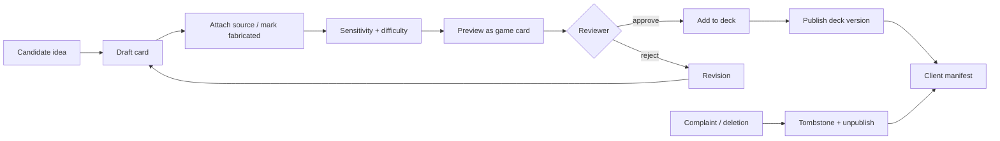

# Content Operations

**Date:** 2026-07-18  
**Thesis:** Content quality and safety—not engineering—are the primary product risk.

---

## 1. Ingestion strategy (recommendation)

| Method | Use? | Notes |
|---|---|---|
| Official X API live in client | **No for MVP** | Cost, ToS, offline conflict |
| Official APIs for editor research only | Maybe | Still ToS constraints on storage/display |
| Licensed datasets / publisher deals | **Yes when available** | Best long-term authentic corpus |
| Manual curation | **Yes — primary MVP** | Highest quality control |
| User submissions | Phase 3 private only | Moderation cost |
| Public archives | Case-by-case + counsel | e.g. speech transcripts |
| Third-party providers | Evaluate | Avoid scrapers that violate ToS |
| Scraping | **No** | Unacceptable operational/legal risk |

**Hybrid MVP:** Editors manually create cards as **PR-reviewed JSON** (no CMS until rematch is proven). Authentic cards cite allowed sources; fabricated cards are original writing. Phase 0 ships one bundled deck; Phase 1 may add Supabase packaging without a Next admin.

---

## 2. Editorial workflow

### Editor steps
1. Import/create candidate statement  
2. Set public figure  
3. Set authenticity  
4. If authentic: record source URL, date, rights status, verification method  
5. If fabricated: record decoy method (`human`), ensure harmless  
6. Assign category, difficulty, sensitivity, locale  
7. Write explanation shown on reveal  
8. Preview typography at forehead sizes  
9. Submit for review  
10. Second editor approves (two-person rule for public figures)  
11. Add to deck; bump semver; promote staging → prod  

### Removal
- Original post deleted / disputed / legal request → set `removal_status=removed`, insert tombstone, republish package or push tombstone-only manifest update within SLA (target &lt;24h when online clients sync).

---

## 3. Fabrication guidelines (editorial)

**Allowed:** Absurdist, stylistic mimicry of public *internet voice* without harmful claims; clearly game content.  
**Banned:** Crimes, hate, sexual content, medical/financial assertions, election falsehoods, private individuals, minors.  
**AI:** Optional assist for brainstorming only; human must rewrite and own; do not ship raw model impersonations; disclose `decoy_method`.

---

## 4. Deck taxonomy (MVP)

1. Pop Voices (general entertainment)  
2. Music  
3. Sports  
4. Tech/Internet Culture  
5. (Optional) Classic Quotes (speeches/interviews—not tweets)

Avoid politics pack at launch.

---

## 5. Volume targets

| Phase | Cards | Decks |
|---|---|---|
| Phase 0 | 50–150 | 1 |
| Phase 1 | 400–800 | 3–5 |
| Phase 2 | Ongoing monthly drops | Rotating |

---

## 6. Admin CMS requirements

- Card CRUD + preview  
- Bulk CSV import with validation  
- Review queue  
- Report queue  
- Tombstone tool  
- Deck packager (build JSON, checksum, upload storage)  
- Audit log viewer  
- Role gates: editor / moderator / admin  

---

## 7. KPIs for content ops

- % cards with complete source metadata (authentic)  
- Median time-to-takedown  
- Report rate per 1k card impressions  
- Playtest “laugh score” / rematch by deck  
- Fabrication screenshot misuse incidents (target: zero serious)  
